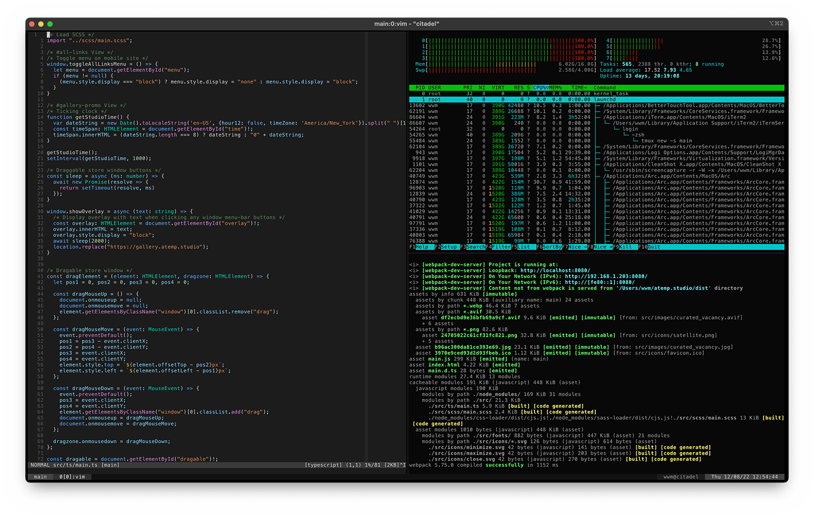

# tmux
## Configuration 🧩
There're too many choices to describe, but the [.tmux.conf](tmux.conf) file itself is well-documented.

### Keybindings
Keybindings are Vi-style
- Split panes
    - `Ctrl-b + s` — Split window horizontally 
    - `Ctrl-b + v` — Split window vertically 
- Pane navigation
    - `Ctrl-b + h` — Move left
    - `Ctrl-b + j` — Move down
    - `Ctrl-b + k` — Move up
    - `Ctrl-b + l` — Move right
- Reize panes
    - `Ctrl-b + <` — Decrease horizontally split pane size
    - `Ctrl-b + >` — Increase horizontally split pane size
    - `Ctrl-b + -` — Decrease vertically split pane size
    - `Ctrl-b + +` — Increase vertically split pane size
- Copy/Paste
    - `Ctrl-b + [` — Enter copy/paste mode (navigate with Vi-style keys)
    - `Ctrl-b + v` — Start selecting text
    - `Ctrl-b + y` — Copy selection
    - `Ctrl-b + P` — Paste selection
- Miscellaneous
    - `Ctrl-b + x` — List current tmux sessions

## Theme 🎨
Like the Vim and Zsh themes, only what's necessary is shown. The theme itself is dark, but when a pane is inactive, the background lightens slightly.

The bottom bar shows the session name, all open windows, the current username and hostname, and the date and time. The name of each window follows the format `window_number:process_name`. If a window is active, it's format is `window_number[pane_number]:process_name`.

