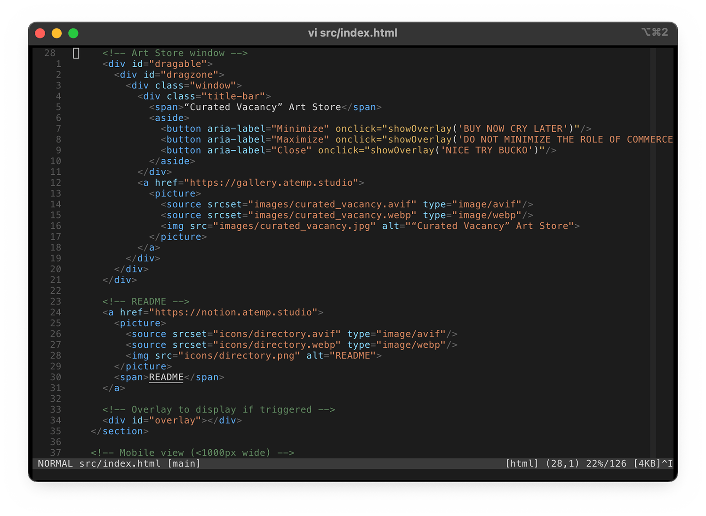

# Vim
## Configuration 🧩
### .vimrc
There're too many choices to describe, but the [.vimrc](vimrc) file itself is well-documented.

### Plugins
- [tpope/vim-commentary](https://github.com/tpope/vim-commentary) — Commenting made easy
- [tpope/vim-surround](https://github.com/tpope/vim-surround) — Quoting/parenthesizing made easy
- [jiangmiao/auto-pairs](https://github.com/jiangmiao/auto-pairs) — Auto-close pairs
- [tpope/vim-repeat](https://github.com/tpope/vim-repeat) — Repeat compatability with vim surround
- [michaeljsmith/vim-indent-object](https://github.com/michaeljsmith/vim-indent-object)	"Indentation as a text object
- [junegunn/fzf.vim](https://github.com/junegunn/fzf.vim) — Fuzzy finder
- [tomasiser/vim-code-dark](https://github.com/tomasiser/vim-code-dark)	— VS Code Colorscheme
- [ap/vim-css-color](https://github.com/ap/vim-css-color) — CSS Color highlighter
- [google/vim-maktaba](https://github.com/google/vim-maktaba) — Dependency of google/vim-codefmt
- [google/vim-codefmt](https://github.com/google/vim-codefmt) — Auto-format code
- [google/vim-glaive](https://github.com/google/vim-glaive)	— Dependency of google/vim-codefmt
- [neoclide/coc.nvim](https://github.com/neoclide/coc.nvim) — Code completion
- [airblade/vim-gitgutter](https://github.com/airblade/vim-gitgutter) — Git status in the gutter

### Leader Mappings
The leader key is `\`. These only work in Vim's normal mode.
- `\p` — Paste from system clipboard
- `\l` — Toggle showing whitespace characters
- `\g` — Toggle GitGutter
- `\s` — Remove trailing whitespace from selected line
- `\S` — Remove trailing whitespace from all lines in buffer
- `\f` — Open netrw file browser in current file directory
- `\F` — Open netrw file browser in home directory
- `\ff` — Fuzzy find files in directory of current file
- `\FF` — Fuzzy find files in home directory
- `\v` — Source the .vimrc
- `\c` — Format selected line(s) of code
- `\C` — Formal entire buffer

### Templates
- [skeleton.py](templates/skeleton.py) — Mark encoding as UTF-8
- [skeleton.sh](templates/skeleton.sh) — Add bash shebang

## Theme 🎨
[Vim Code Dark](https://github.com/tomasiser/vim-code-dark) is a nice VS-Code-like colorscheme. Additionally, this config has a nice, minimal status line showing the currne toprating mode, buffer number, filename, git branch, type of file in the buffer, line number and column number of cursor, percent of the way through the file the cursor is at, total line count, and the file size of the buffer.

