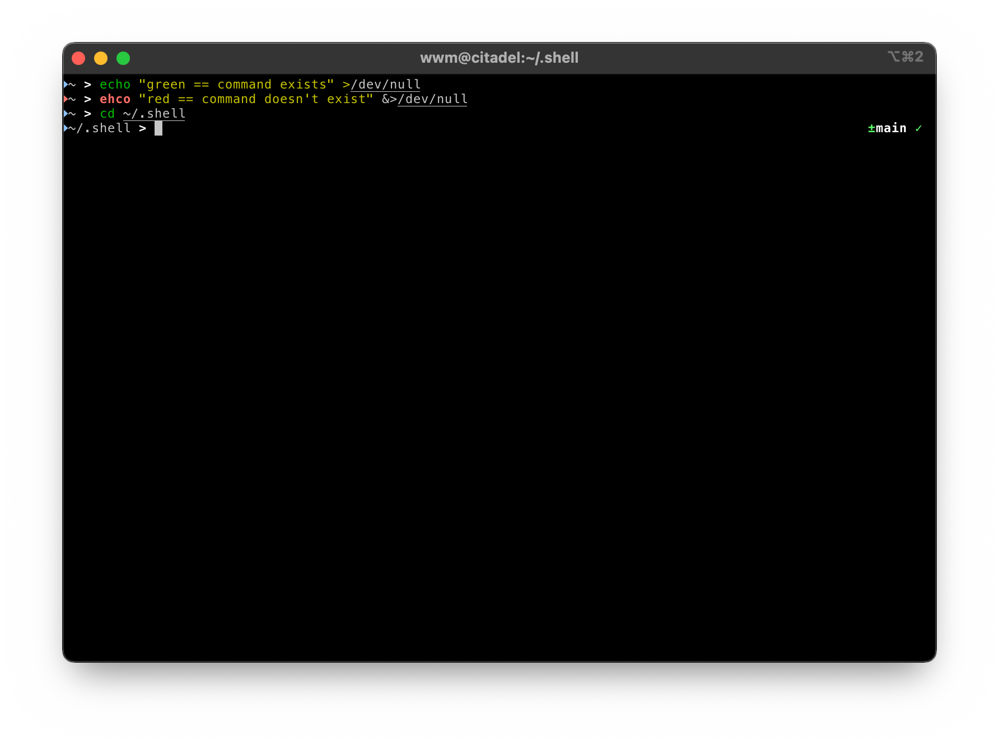

# Zsh
## Configuration 🧩
### .zshrc
- Install (if necessary) [Oh-My-Zsh](https://ohmyz.sh/) and the two plugins we use, enabling [autosuggestions](https://github.com/zsh-users/zsh-autosuggestions) and [syntax highlighting](https://github.com/zsh-users/zsh-syntax-highlighting)
- Export the PATH variable, exposing the binaries we installed to the command line
- Configure [fzf](https://github.com/junegunn/fzf)
- Vimify everything
  - Vi mode to navigate command line
    - `v` in escape mode launches Vim with current string
  - Use [Vim](https://github.com/vim/vim) for manpages
- Load all [aliases](aliases) and [functions](functions)
- Launch [tmux](https://github.com/tmux/tmux) on start
  - If no session present, starts new session with name `main`
  - If session present, starts new session with name in format `alt[n_sessions - 1]` (e.g. `alt0`, `alt1`, etc.)
  
### .aliases
- `pbcopy` — Copy to clipboard (works across macOS, Linux, WSL)
- `pbpaste` — Paste from clipboard (works across macOS, Linux, WSL)
- `open` — Open a file/directory (works across macOS, Linux, WSL)
- `ls` — Use [exa](https://github.com/ogham/exa) instead of `ls`
- `tree` — Use [exa](https://github.com/ogham/exa) with `-T` instead of `tree`
- `o` — Open current directory in system file explorer
- `pfkill` — Like `pkill`, but leveraging [fzf](https://github.com/junegunn/fzf)
- `ds` — change directory into `~/Desktop`
- `dc` — change directory into `~/Documents`
- `dl` — change directory into `~/Downloads`
- `tmcp` — Copy tmux buffer into system clipboard
- `expandurl` — Follow URL redirects, and return final location
- `hidedesktop` — Hide all files on desktop (macOS only)
- `showdesktop` — Show all files on desktop (macOS only)
- `afk` — Lock the display (macOS only)

### .functions
- `ip` — Fetch a machine's local and public IP addresses
- `mkd` — Make a directory and `cd` into it (works recursively)
- `dataurl` — Make a dataurl for a given file
- `cdf` — Change directory to match the current one in Finder

## Theme 🎨
There’s not much to my default Zsh theme — just a simple left prompt showing the current path and a right prompt showing git status if available. For the left prompt, if the user is `root`, the leader, `>`, changes from bold white to bold red.

The below image additionally shows off the usefullness of [Zsh syntax highlighting](https://github.com/zsh-users/zsh-syntax-highlighting).

